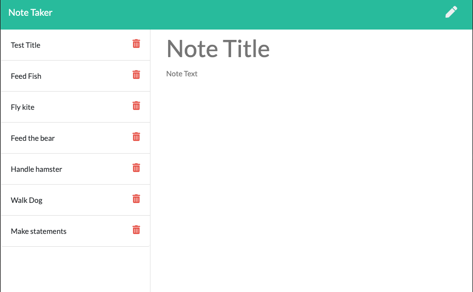
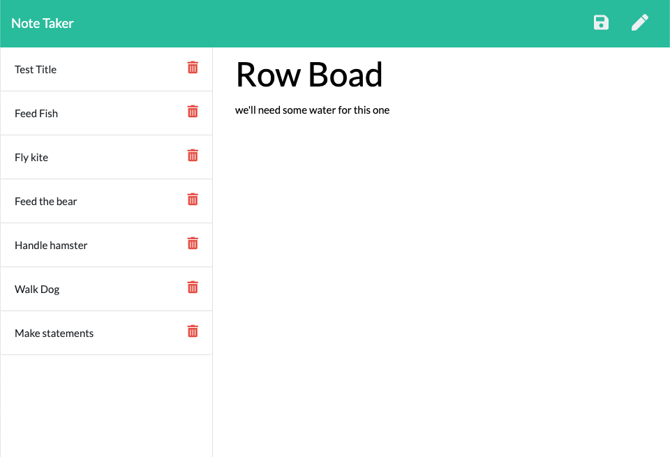

# Note Taker

## Description

My motivation was to build an app were the user could write and save their notes. Now the user will be able to look at the app from anywhere and find their saved notes. While working on this project I learned more about express.js, node.js and backend web development.

## Usage

Just go to the app and enter the title and text for your note.  

By pressing the save button your note will be saved on the left and side. Click on it to see it highlighted with text below. Click on the pencil button to start a new note.

You can visit the app [HERE](https://mysterious-peak-26125.herokuapp.com/)

## Credits

--[Express.JS](https://expressjs.com/) 
--[Node.JS](https://nodejs.org/en/)

## License

MIT License

Copyright (c) [2021] [Peter C MoDavis]

Permission is hereby granted, free of charge, to any person obtaining a copy
of this software and associated documentation files (the "Software"), to deal
in the Software without restriction, including without limitation the rights
to use, copy, modify, merge, publish, distribute, sublicense, and/or sell
copies of the Software, and to permit persons to whom the Software is
furnished to do so, subject to the following conditions:

The above copyright notice and this permission notice shall be included in all
copies or substantial portions of the Software.

THE SOFTWARE IS PROVIDED "AS IS", WITHOUT WARRANTY OF ANY KIND, EXPRESS OR
IMPLIED, INCLUDING BUT NOT LIMITED TO THE WARRANTIES OF MERCHANTABILITY,
FITNESS FOR A PARTICULAR PURPOSE AND NONINFRINGEMENT. IN NO EVENT SHALL THE
AUTHORS OR COPYRIGHT HOLDERS BE LIABLE FOR ANY CLAIM, DAMAGES OR OTHER
LIABILITY, WHETHER IN AN ACTION OF CONTRACT, TORT OR OTHERWISE, ARISING FROM,
OUT OF OR IN CONNECTION WITH THE SOFTWARE OR THE USE OR OTHER DEALINGS IN THE
SOFTWARE.

## Badges

